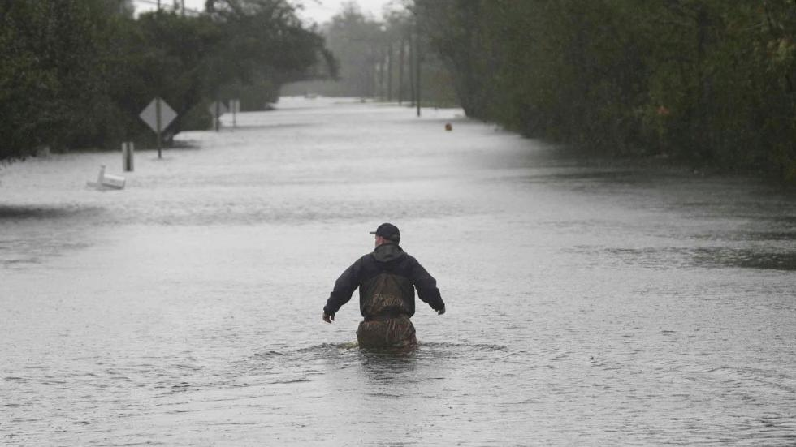

# Extracting Flood Depths From Imagery

## Problem Statement
---
Flooding is one of the most common and most destructive forms of natural disasters.  Current flood detection and measurement systems lack accuracy and expedience to keep people out of danger.  We built a Convolutional Neural Network (cNN) that leverages uploaded personal photos to provide flood detection and depth measurement to expedite alerts and increase safety.

## Executive Summary
---
Teaching a computer to detect water much less a water line is something that has troubled researchers for years per the attached research library.  As a result, we chose to leverage the Google Vision AI to act as an image preprocessor that would identify prerequisite objects and flooding.  By verifying those conditions, we could train a Convolutional Neural Network using VGG16 to determine the level of submersion of those specific objects.  Based on the interpretation of that submersion level, we could infer a relative depth of the floodwater.

## Data
---
In order to train our neural network we required a large quantity and variety of flood images.  Several research projects had large libraries of training images for their respective model.  The dataset is smaller than we hoped.  

 


## Image Processing
---


### Gooogle Vision AI


 
### VGG16 cNN

 Image Credit: K. Simonyan and A. Zisserman, University of Oxford


### Person Submersion Detection


### Truck Submersion Detection

 
 
## Issues
---
1. People can swim
2. Shortage of training data
3. 


## Future Improvements
---
Extract latitude and longitude from EXIF OR user input
Determine elevation based on location
Project flood level to surrounding area at simliar elevation


## Project Organization
---
```
|__ code
|   |__ google-vision-api
|   |   |__ 01_Google_Vision_API.ipnyb
|   |   |__ 02_Parse_Image_Labels.ipynb
|   |   |__ README.md
|   |   |__ output
|   |   |   |__ labels.csv
|   |__ 03_Image_Augmentation_Trucks.ipnyb
|   |__ 04_Flood_Depth_ModelTraining_Trucks.ipynb
|   |__ 05_Flood_Depth_Prediction_Trucks.ipynb
|   |__ 06_Image_Augmentation_People.ipynb
|   |__ 07_Flood_Depth_ModelTraining_People.ipnyb
|   |__ 08_Flood_Depth_Prediction_People.ipnyb
|   |__ README.md
|__ images (see file tree image below)
|__ Project_presentation.pdf
|__ environment.yml
|__ flood_detection_resources_research_utilities.pdf
|__ README.md
```


