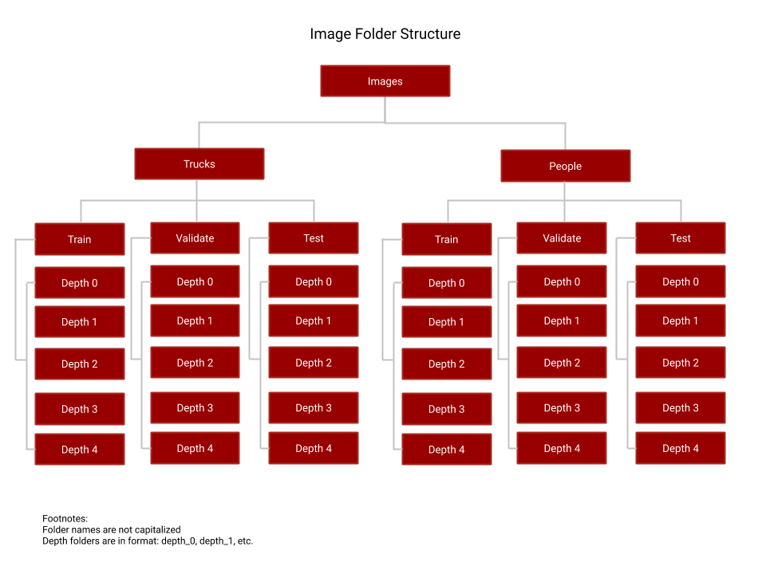

# Extracting Flood Depths From Imagery

## Problem Statement
---
Flooding is one of the most common and most destructive forms of natural disasters.  Current flood detection and measurement systems lack accuracy and expedience to keep people out of danger.  We built a Convolutional Neural Network (cNN) that leverages uploaded personal photos to provide flood detection and depth measurement to expedite alerts and increase safety.

## Executive Summary
---
Teaching a computer to detect water much less a water line is something that has troubled researchers for years per the attached research library.  As a result, we chose to leverage the Google Vision AI to act as an image preprocessor that would identify prerequisite objects and flooding.  By verifying those conditions, we could train a Convolutional Neural Network using VGG16 to determine the level of submersion of those specific objects.  Based on the interpretation of that submersion level, we could infer a relative depth of the floodwater.

## Data
---
Our neural network required a large quantity and variety of flood images.  Several research projects procured extensive libraries of training images for their respective models. Some provided access to these images, but many did not.   Additionally, since we did not have the same amount of time as the researchers, as mentioned earlier, we selected training images like the ones below with obvious subjects.  This criterion further limited the number of available images for training and testing the models. 

 


## Image Processing
---


### Gooogle Vision AI

Google Vision AI is accessible through a Python API.   It is the same AI that powers Google Lens.  Google designed the  AI to identify every object in an image and also identify labels for the scene.  Then it provides accuracy predictions for those interpretations.  The images below give an example of the output.  Google does not charge for the first 1,000 calls to the AI, and after it is $1.50/1,000 calls.  We used this API as a pre-filter to detect flooding and a person, truck, or both in the photograph.

 
### VGG16 cNN

We selected the VGG16 architecture [ref to original paper]. The advantage of the VGG16 architecture is that it performs with high accuracy for image classification and has a relatively simple architecture to implement. On the downside, achieving a high level of accuracy is time and computationally expensive.  Similarly, both the model and the files that it produces are huge.

 Image Credit: K. Simonyan and A. Zisserman, University of Oxford

### Truck Submersion Detection

better results on level 0,1,2 than the deeper water
If we only count EXACT results, then the accuracy is 32%
but, if we look at 'off by 1' as close enough, then the accuracy is more like 72/90, or about 80% which sounds a lot more hopeful for the future of this method
this model runs in about an hour on a macbook pro 2.4GHz, 8-core intel i9, with 32 GB RAM
the original paper on the VGG16 indicates that they trained for weeks and with high end GPUs; we did not have enough images for that to make sense nor enough time to run that long
trucks had ~160 base images, x5 after augmentation; augmentation made a huge difference, I would expect more images to continue to improve the model
I don't think we've reached the end of what this model can do for us; not sure if that's the same for people or not

 

### Person Submersion Detection

People Model
Baseline accuracy: 23.5%
Best accuracy: 25%
Accuracy if included depths off by 1 as accurate: 60%
Runs in 2 hours with MacPro 2.4 GHz Quad-Core Intel Core i5, 8GB RAM
Better at predicting 0s and 4s
323 training images, 263 of them were augmented


 
## Issues
---
1. People can swim
2. Shortage of training data
3. 

another challenge is the definition of some of the levels; what level should we put for truck moving through water where the displacement at the back makes it look like 6", but the "bow wake" at the front bumper makes it look like almost 2 feet?

as others have pointed out, the depth is only for one point in the image, at the point of that particular object, so complex photos with multiple trucks sitting in different amounts of water or being different sized trucks may be problematic
we also can't rule out that the differentiation is happening because of something like the height of the water in the image, as discovered by Jonna

 
 
 

## Future Improvements
---
Extract latitude and longitude from EXIF OR user input
Determine elevation based on location
Project flood level to surrounding area at simliar elevation


## Project Organization
---
```
|__ code
|   |__ google-vision-api
|   |   |__ 01_Google_Vision_API.ipnyb
|   |   |__ 02_Parse_Image_Labels.ipynb
|   |   |__ README.md
|   |   |__ output
|   |   |   |__ labels.csv
|   |__ 03_Image_Augmentation_Trucks.ipnyb
|   |__ 04_Flood_Depth_ModelTraining_Trucks.ipynb
|   |__ 05_Flood_Depth_Prediction_Trucks.ipynb
|   |__ 06_Image_Augmentation_People.ipynb
|   |__ 07_Flood_Depth_ModelTraining_People.ipnyb
|   |__ 08_Flood_Depth_Prediction_People.ipnyb
|   |__ README.md
|__ images (see file tree image below)
|__ Project_presentation.pdf
|__ environment.yml
|__ flood_detection_resources_research_utilities.pdf
|__ README.md
```




