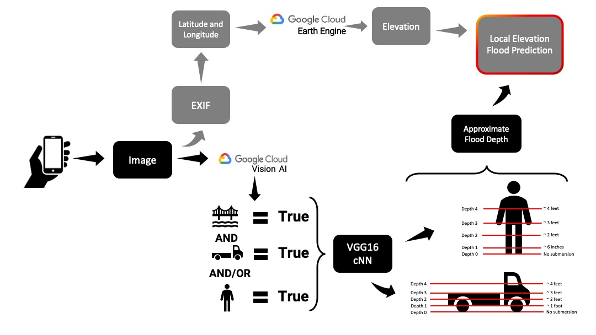
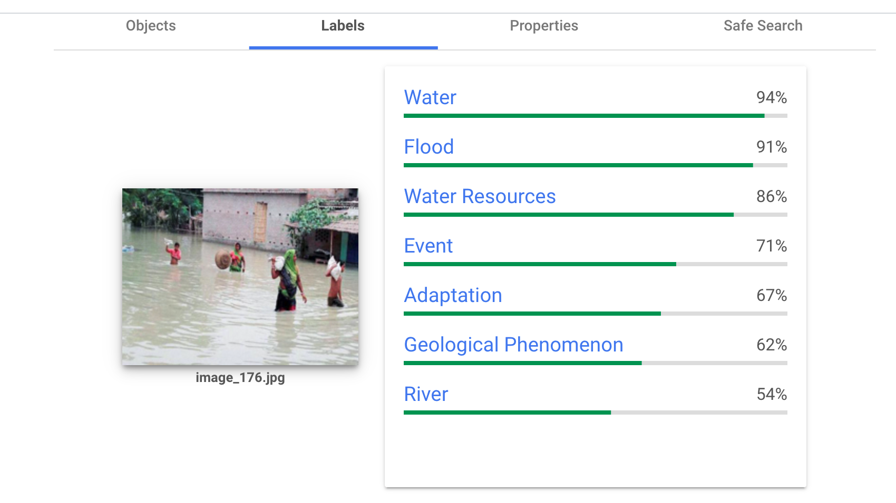
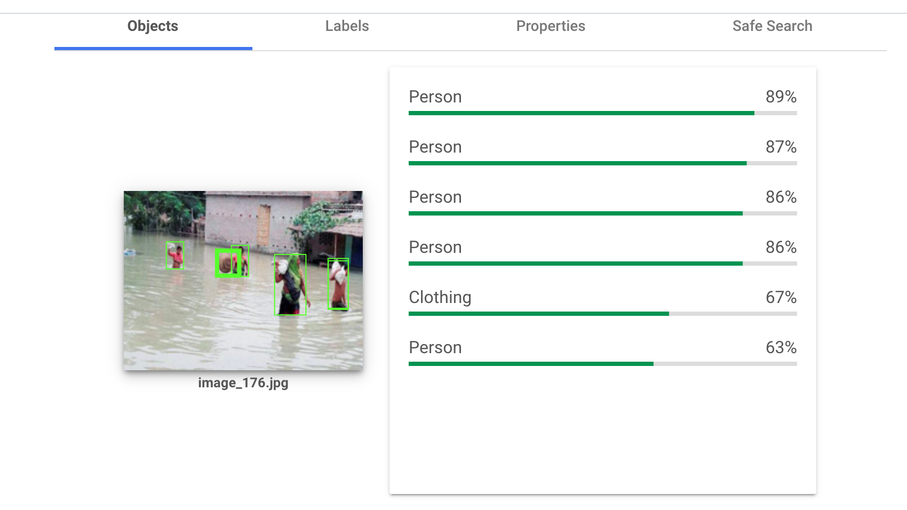
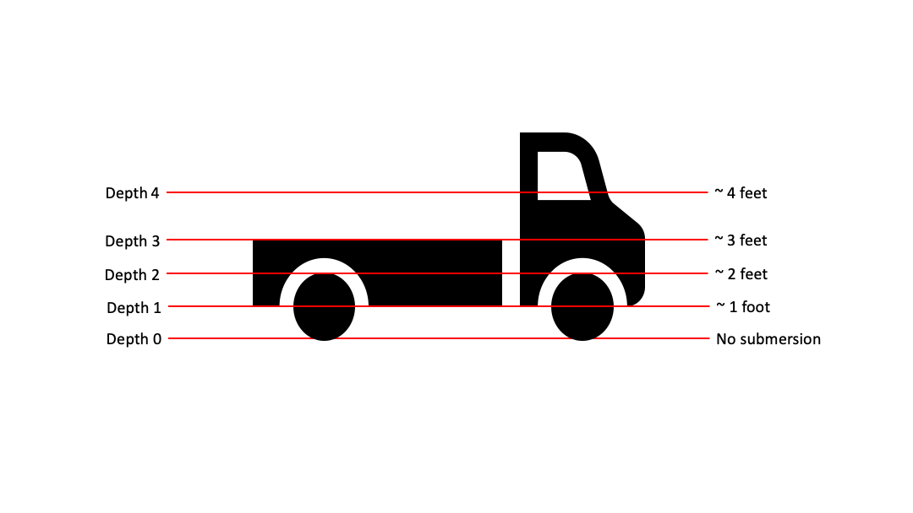
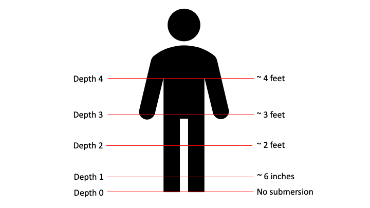
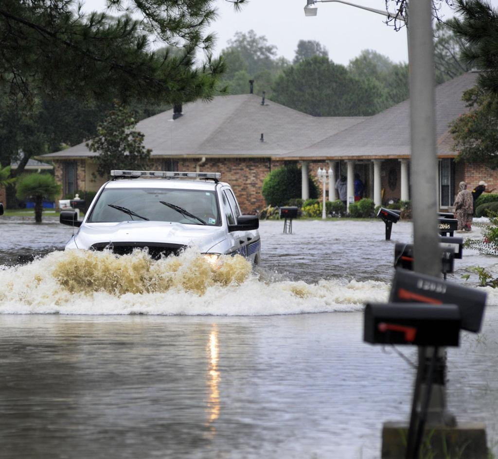
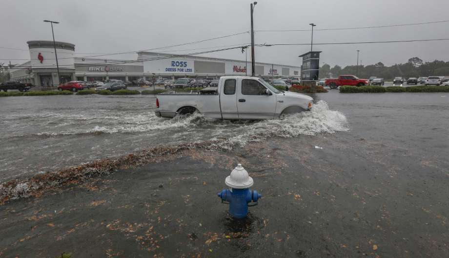
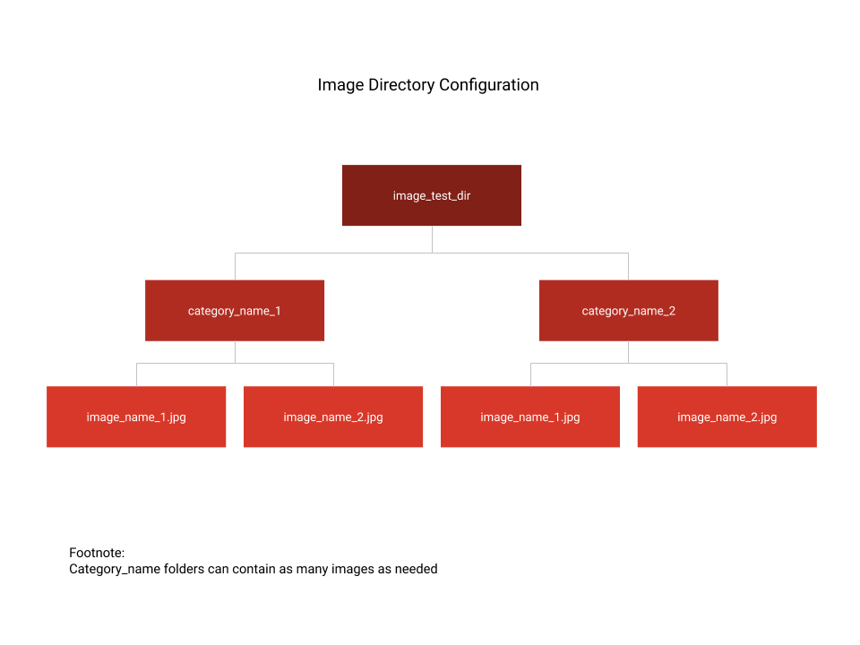

# Extracting Flood Depths From Imagery


## Problem Statement
---
Flooding is one of the most common and most destructive forms of natural disasters.  Current flood detection and measurement systems lack accuracy and expedience to keep people out of danger.  We built a Convolutional Neural Network (cNN) that leverages uploaded personal photos to provide flood detection and depth measurement to expedite alerts and increase safety.

## Executive Summary
---
Teaching a computer to detect water much less a water line is something that has troubled researchers for years per the attached research library.  As a result, we chose to leverage the Google Vision AI to act as an image preprocessor that would identify prerequisite objects and flooding.  By verifying those conditions, we could train a Convolutional Neural Network using VGG16 to determine the level of submersion of those specific objects.  Based on the interpretation of that submersion level, we could infer a relative depth of the floodwater.

## Data
---
Our neural network required a large quantity and variety of flood images.  Several research projects procured extensive libraries of training images for their respective models. Some provided access to these images, but many did not.   Additionally, since we did not have the same amount of time as the researchers, as mentioned earlier, we selected training images like the ones below with obvious subjects.  This criterion further limited the number of available images for training and testing the models.

 


## Image Processing
---


### Gooogle Vision AI

Google Vision AI is accessible through a Python API.   It is the same AI that powers Google Lens.  Google designed the  AI to identify every object in an image and also identify labels for the scene.  Then it provides accuracy predictions for those interpretations.  The images below give an example of the output.  Google does not charge for the first 1,000 calls to the AI, and after it is $1.50/1,000 calls.  We used this API as a pre-filter to detect flooding and a person, truck, or both in the photograph.

 
### VGG16 cNN

We selected the VGG16 architecture [https://neurohive.io/en/popular-networks/vgg16/]. The advantage of the VGG16 architecture is that it performs with high accuracy for image classification and has a relatively simple architecture to implement. On the downside, achieving a high level of accuracy is time and computationally expensive.  Similarly, both the model and the files that it produces are huge.

#### VGG16 cNN Architecture
 Image Credit: K. Simonyan and A. Zisserman, University of Oxford

For this project, we decided to narrow our object analysis to only people and trucks to demonstrate proof of concept.  We chose people because they are commonly photographed in floodwaters, which makes training a model more manageable.  For trucks, we took a different approach; we wanted to train a model on a type of object that no other researchers had used before.

### Truck Submersion Detection

 

Generally speaking, the VGG16 architecture performed really well despite our relatively small training dataset.  While it only scored 32% accuracy on the exact depth level for trucks,  accuracy jumped to roughly 80% if we increased to the tolerance plus or minus one depth level.  We trained the model on just 160 images that we boosted fivefold through augmentation (i.e., flipping, cropping, and turning).   Therefore, with more training images, we are confident we could considerably improve accuracy on trucks.

### Person Submersion Detection



Similar to vehicle submersion prediction, the model performed quite admirably on people under the given constraints of time and processor power.  The model accurately predicted the exact depth level 25% of the time and provided a plus or minus one tolerance accuracy improved to 60%.  Unlike the truck model, the people model performed better at predicting people at depth level 0 or 4.

## Issues
---
1. People can swim
2. Shortage of training data
3. Bow wake
4. Personal computer processing power
5. Complex images
6. Micro terrain
7. Time constraint
8. Definition of depth levels

**Bow wake example**    

What level should we assign for a truck moving through water where the displacement at the back makes it look like 6", but the "bow wake" at the front bumper makes it look like almost 2 feet? As other researchers have pointed out, depth is only for one point in the image, at the point of that particular object. Complex images, tilted vehicles, multiple vehicles, and displaced water are all interesting complications.

|Bow wake - front view| Bow wake - side view|
|---|---|
|| |

## Future Improvements
---
* Extract latitude and longitude from EXIF OR user input
* Determine elevation based on location
* Project flood level to surrounding area at similar elevation
* Explore image variety to ensure model isn't using a false reference (color of truck, height of water in image)


## Project Organization
---
```
|__ assets
|   |__flow_chart.jpg
|   |__image_test_dir_diagram.png
|   |__ImageFolderStructure.png
|   |__img_0080.jpg
|   |__img_0099.jpg
|   |__img_0110.jpg
|   |__img_0112.jpg
|   |__img_0120.jpg
|   |__people_A3_P3_person_and_truck.png
|   |__person_depth_chart.png
|   |__truck_A1_P1_bow_wake.png
|   |__truck_A2_P2_person_and_truck.png
|   |__truck_A3_P2_slanted.png
|   |__truck_depth_chart.png
|   |__truck_result_woman_on_vehicle.png
|   |__vgg16_neural_network.jpg
|   |__vision_AI1.png
|   |__vision_AI2.png
|   |__vision_AI3.png
|   |__vision_AI4.png
|__ code
|   |__ google-vision-api
|   |   |__ 01_Google_Vision_API.ipnyb
|   |   |__ 02_Parse_Image_Labels.ipynb
|   |   |__ README.md
|   |   |__ images
|   |   |   |__ image_to_label.jpg (any number of images to use with the API)
|   |   |__ output
|   |   |   |__ labels.csv
|   |__ 03_Image_Augmentation_Trucks.ipnyb
|   |__ 04_Flood_Depth_ModelTraining_Trucks.ipynb
|   |__ 05_Flood_Depth_Prediction_Trucks.ipynb
|   |__ 06_Image_Augmentation_People.ipynb
|   |__ 07_Flood_Depth_ModelTraining_People.ipnyb
|   |__ 08_Flood_Depth_Prediction_People.ipnyb
|   |__ README.md
|__ images (see file tree image below)
|__ Project_presentation.pdf
|__ environment.yml
|__ flood_detection_resources_research_utilities.pdf
|__ README.md
```



## Project Team

Jamie Shaffer - Josh Kuehl - Jonna Pander - Clint Hoke
